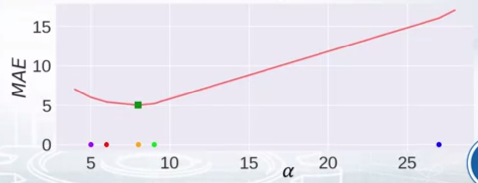

# Metrics trong Machine Learning - Regression

Trong phần này ta sẽ tìm hiểu về các metrics sau:
1. MSE - Mean Square Error
2. RMSE - Root Mean Square Error
3. R-Squared
4. MAE - Mean Absolute Error

và `constant model` của chúng 

> `constant model`: if we have to predict the same value for every object, what value is optimal to predict according to the chosen metric 

có thể hiểu `constant model` là base model của chúng ta, nếu model của chúng ta predict có score dưới score của base model => model chúng ta tệ hơn một model không học gì cả. 

## Notation

## 1. MSE - Mean Square Error 
> MSE calculate square different between the predictions and the target and then average those values over the examples. 

Với biểu đồ bên dưới, trục X gồm các predictions (5, 6, 8, 9, 27) và trục Y đại diện cho MSE score. Có thể thấy nếu chỉ được dự đoán một giá trị thì 11 `(Best contant : mean value)` sẽ cho MSE score tốt nhất.

## 2. RMSE - Root Mean Square Error
> RMSE is very similar metric to MSE, first, we calculate MSE then we take a squared root of MSE

### MSE vs RMSE
Việc sử dụng RMSE khiến cho việc plot metric dể hình dung hơn bởi vì phương trình bây giờ là tuyến tính 

Về khía cạnh minimizers RMSE và MSE là một. Chúng ta có thể suy ra: 
MSE(a) > MSE(b) => RMSE(a) => RMSE(b) 

+ Khác biệt:
    phương trình đạo hàm của hai metric. Có thể thấy đạo hàm của RMSE bằng chính đạo hàm của MSE nhân thêm 1 hằng số 1/2sqrt(mse). Điều này khiến cho chúng ko thể interchangable for gradient based method. Nghĩa là chúng ta cần phải điều chỉnh một số hyperparameter khi thay đổi giữa 2 metric (learning rate là một ví dụ).
    

## 3. R-Squared 

Giả sử nếu ta nói MSE score của model là 32, hay RMSE của model là 0.4 liệu chúng ta có biết được model này tốt hay không?

> R2 measure how much our model is better than constant baseline, R2 will give us 0 if we are no better than baseline and 1 if the predictions are perfect.

## 4. MAE - Mean Absolute Error

> MAE calculate an everage of absolute differences between the target values and the predictions

Điều quan trọng ở metric này là nó không penalize huge error như MSE (`not sensitive to outliers as MSE`)

best contant : median 

### MAE vs MSE
+ Có outliers trong data? -> MAE 
+ Chúng có thật sự là outliers? -> MAE
+ Hoặc chúng là unexpected values mà chúng ta cần để ý? -> MSE 

# Take away
- MSE, RMSE, R-Squared 
    + Giống nhau hoàn toàn về khía cạnh "optimization"
- MAE
    + `Robust` hơn đối với outliers 

# References
+ How to win Data Science Competition: Learn from Top Kaggler - Week 3 - Metric optimization - Regression metrics review I 