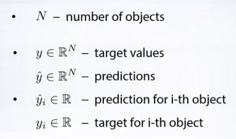
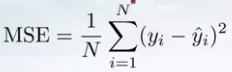
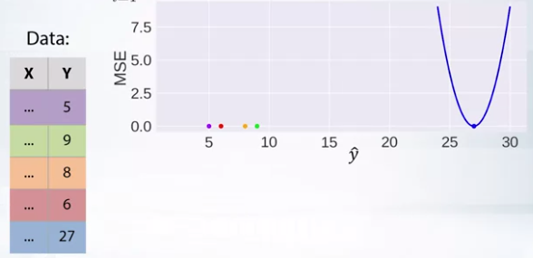
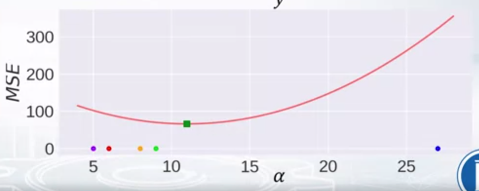
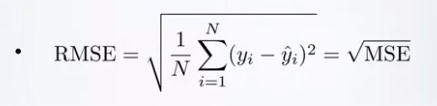
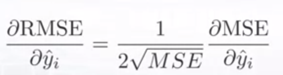
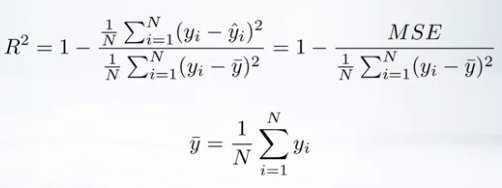
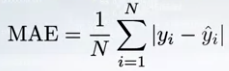

# Metrics trong Machine Learning - Regression

Trong phần này ta sẽ tìm hiểu về các metrics sau:
1. MSE - Mean Square Error
2. RMSE - Root Mean Square Error
3. R2 
4. MAE - Mean Absolute Error

và `constant model` của chúng 

> `constant model`: if we have to predict the same value for every object, what value is optimal to predict according to the chosen metric 

có thể hiểu `constant model` là base model của chúng ta, nếu model của chúng ta predict có score dưới score của base model => model chúng ta tệ hơn một model không học gì cả. 

## Notation

## 1. MSE - Mean Square Error 

> MSE calculate square different between the predictions and the target and then average those values over the examples. 

Giả sử, chúng ta có tập dataset và biểu đồ bên phải với trục Y đại diện cho MSE và trục X đại diện cho kết quả dự đoán của model chúng ta. Giả sử chúng ta dự đoán đúng 4 example đầu tiên, thì ở example cuối cùng chúng ta sẽ có đường parabolal tương ứng như hình vẽ 

Best contant : mean value

## 2. RMSE

> RMSE is very similar metric to MSE, first, we calculate MSE then we take a squared root of MSE

Việc sử dụng RMSE khiến cho việc plot metric dể hình dung hơn bởi vì phương trình bây giờ là tuyến tính 

Về khía cạnh, minimizers RMSE và MSE là một. Điều này có nghĩa là 
MSE(a) > MSE(b) => RMSE(a) => RMSE(b) 

Điều khác biệt duy nhất là phương trình đạo hàm của hai metric. Có thể thấy đạo hàm của RMSE bằng chính đạo hàm của MSE nhân thêm 1 hằng số 1/2sqrt(mse). Điều này khiến cho chúng ko thể interchangable for gradient based method. Nghĩa là chúng ta cần phải điều chỉnh một số hyperparameter khi thay đổi giữa 2 metric (learning rate là một ví dụ).

## R2 

Giả sử nếu ta nói MSE score của model là 32, hay RMSE của model là 0.4 liệu chúng ta có biết được model này tốt hay không. Chính vì lý do đó R2 ra đời. R2 = 1 model tốt hơn, R2 = 0 model bth , R2 < = 1 model tệ 

## MAE

best contant : median 

# Take away

+ Have outliers: MAE
+ sure outliers?: MAE 
+ unexpected value we should care? MSE 
